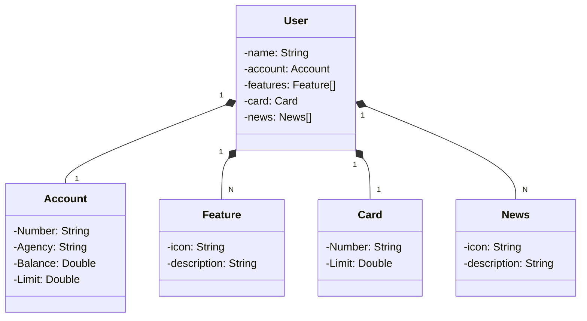

# Bootcamp Santander Java Backend
Java RESTful API criada para o bootcamp santander java backend 2023

## Diagrama de classes

```mermaid
classDiagram
  class User {
    -name: String
    -account: Account
    -features: Feature[]
    -card: Card
    -news: News[]
  }
  class Account {
    -Number: String
    -Agency: String
    -Balance: Double
    -Limit: Double
  }
  class Feature {
    -icon: String
    -description: String
  }
  class Card {
    -Number: String
    -Limit: Double
  }
  class News {
    -icon: String
    -description: String
  }

  User "1" *-- "1" Account
  User "1" *-- "N" Feature
  User "1" *-- "1" Card
  User "1" *-- "N" News
```
